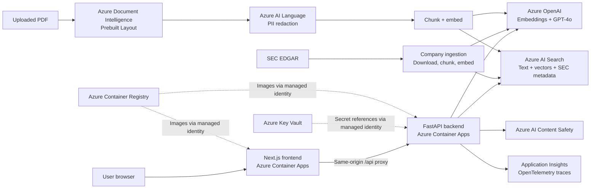
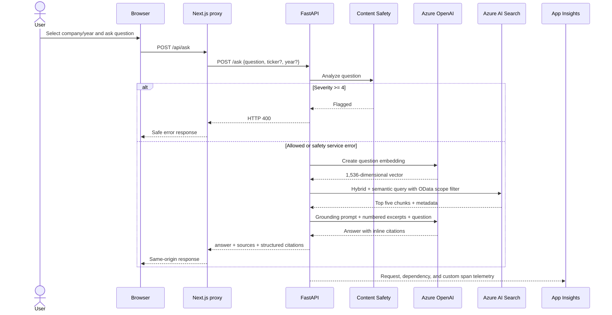
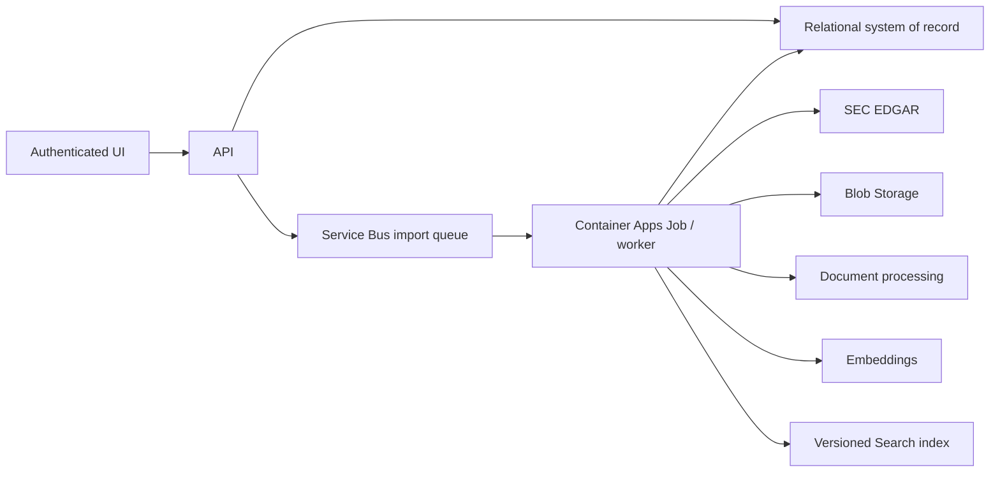

# FilingsIQ — Complete Business and Technical System Analysis

**Document version:** 1.1
**Analysis date:** 2026-08-10 (Stage 10 addendum added 2026-09-22 — see the note at the top of
each section that changed; the body text otherwise still describes the Stage 9 snapshot)
**System state covered:** Stage 9, sub-steps S9.1–S9.6 deployed, **plus Stage 10** (SEC company
search with year-scoped background import, and a UI redesign) — see
[ADR-007](adr/ADR-007-sec-search-and-ui-redesign.md)
**Production snapshot last verified in the project log:** 2026-09-21  
**Live application:** <https://filingsiq-frontend.whitepebble-50a8bf56.eastus2.azurecontainerapps.io>  
**Repository:** <https://github.com/leopbar/FilingsIQ>

---

## 1. Executive summary

FilingsIQ is an Azure-based artificial intelligence system that allows a user to ask natural-language questions about United States Securities and Exchange Commission (SEC) filings and receive answers grounded in the original documents, with traceable citations.

The main business problem is information overload. A single annual report can contain hundreds of pages of narrative disclosures, legal language, risk factors, accounting notes, and dense financial tables. An analyst who needs one fact normally has to locate the correct company, filing, fiscal year, section, and table, then interpret the surrounding context. FilingsIQ changes that interaction from document navigation to question answering:

> Select a company and fiscal year, ask a question, and receive an answer generated only from relevant excerpts of the selected filings, with links back to the authoritative SEC source.

The production application currently contains five 10-K annual reports for Apple (`AAPL`) and five for Microsoft (`MSFT`), covering FY2021–FY2025, plus whatever additional companies have since been searched and imported live through the app. As of Stage 10 (2026-09-21), anonymous SEC company search and import is **enabled** in production rather than disabled: any visitor can search SEC EDGAR by name or ticker and import up to **2 fiscal years per request** as a background job with progress polling. This reverses the earlier Stage 9 decision to disable import outright; instead of an on/off switch, the risk of unauthenticated paid ingestion work is bounded per-request (2-year cap, one job at a time, a single backend replica) rather than eliminated. The application still does not have user authentication or authorization — see [ADR-007](adr/ADR-007-sec-search-and-ui-redesign.md) and §11.2 below. It also supports company- and year-scoped retrieval, structured filing citations, a temporary PDF upload workflow, and a separate legal-clause classifier based on a fine-tuned GPT-4o model.

Technically, the core is a Retrieval-Augmented Generation (RAG) architecture:

1. SEC filings are downloaded, normalized, split into overlapping chunks, and converted into 1,536-dimensional embeddings.
2. Chunk text, vectors, and filing metadata are stored in Azure AI Search.
3. A user's question is screened by Azure AI Content Safety and converted into an embedding.
4. Azure AI Search performs hybrid retrieval: BM25 keyword search plus HNSW vector search, followed by semantic re-ranking.
5. The five highest-ranked excerpts are passed to GPT-4o with a strict grounding prompt.
6. The API returns the generated answer, raw source excerpts, structured SEC metadata, and links to the original filing.

This architecture was selected because it separates knowledge from generation. Regulatory filings change and must remain auditable; encoding their facts through model fine-tuning would be expensive, difficult to update, and weak for citation traceability. RAG keeps documents in a searchable external knowledge layer, uses the LLM for interpretation and language generation, and preserves a path from every answer back to source evidence.

Azure is used throughout: Azure OpenAI, Azure AI Search, Azure Document Intelligence, Azure AI Language, Azure AI Content Safety, Application Insights, Key Vault, Container Registry, and Container Apps. The primary operational data store is Azure AI Search rather than a relational database. It stores both unstructured chunk text and structured SEC metadata and serves as a search engine, vector database, metadata filtering layer, and retrieval API.

The project is deliberately broader than a chat screen. It also demonstrates document processing, PII handling, multi-company ingestion, PySpark/MLflow batch processing, fine-tuning, automated RAG evaluation with RAGAS, observability, content screening, containerization, cloud deployment, and architectural governance through ADRs.

---

## 2. What the system is about

### 2.1 Business domain

Public companies in the United States submit filings to the SEC through EDGAR. Important forms include:

- **10-K:** annual report containing audited financial statements, business description, risks, management discussion, controls, legal matters, and extensive notes.
- **10-Q:** quarterly report with interim financial and operational information.
- **8-K:** current report describing material events.

The current persistent FilingsIQ workflow focuses on the latest five **10-K filings** for each indexed company. The metadata contract was designed so that more form types can be added later, but persistent 10-Q and 8-K ingestion is not yet implemented.

FilingsIQ is therefore a specialized document intelligence and knowledge retrieval system. Although the demonstration domain is financial/regulatory reporting, the underlying pattern is reusable for contracts, policies, technical manuals, clinical documents, audit evidence, and other large document collections.

### 2.2 The business problem

Traditional filing analysis has several friction points:

- Documents are long and information-dense.
- The same concept may be expressed differently across companies and years.
- Exact values are often embedded in tables.
- A keyword search may find a term but not understand semantic intent.
- A general-purpose LLM may answer from prior knowledge, which is unacceptable when the user needs evidence from a specific filing.
- Comparing multiple filings requires careful scope control; otherwise information from different companies or years can be mixed.
- Regulatory and analytical work requires provenance: the user must be able to inspect where an answer came from.

FilingsIQ addresses these issues by combining structured scope controls, semantic retrieval, exact-term retrieval, grounded generation, and filing-level provenance.

### 2.3 Business value proposition

The system offers five primary forms of value:

1. **Faster research:** users can move directly from a question to likely relevant passages instead of manually reading or searching hundreds of pages.
2. **Better evidence traceability:** answers include numbered citations, source excerpts, filing dates, accession numbers, and authoritative SEC URLs.
3. **Reduced hallucination risk:** the model is instructed to use only retrieved excerpts and to state when evidence is insufficient.
4. **Consistent scope:** company and fiscal-year filters are applied in the retrieval query, not merely mentioned in the prompt.
5. **Reusable AI architecture:** the same ingestion, indexing, retrieval, evaluation, safety, and monitoring patterns can serve other enterprise document domains.

### 2.4 Intended users and stakeholders

Potential users include:

- Equity research and investment analysts.
- Corporate finance and strategy teams.
- Auditors and risk professionals.
- Legal and compliance teams.
- Investor relations teams.
- Students and researchers studying public companies.
- Azure AI architects evaluating an end-to-end reference implementation.

Business stakeholders would typically include a product owner, data/document owners, compliance and security reviewers, cloud operations, AI/ML engineers, application developers, and end users who validate answer usefulness.

### 2.5 Current user-facing capabilities

#### Ask questions about indexed SEC filings

The user selects an indexed company, optionally selects a fiscal year, enters a question, and receives:

- A natural-language answer.
- Inline citation markers such as `[1]` and `[2]`.
- The raw excerpts used to generate the answer.
- Structured metadata for each source.
- A link to the original filing on `sec.gov` when SEC metadata is present.

#### Select company and fiscal year

The company list is derived from facets and documents in Azure AI Search. The fiscal-year selector is populated from the selected company's indexed metadata. Retrieval filters prevent a question scoped to Microsoft from retrieving Apple chunks and prevent an FY2023 question from retrieving FY2025 evidence.

#### Search and import a company from SEC EDGAR (Stage 10 — now live in production)

A user can search SEC-listed companies by name or ticker (`GET /sec/search`), preview a
company's available 10-Ks with each year flagged as already-indexed or not (`GET
/sec/filings`), and import **up to 2 fiscal years** as a background job (`POST /sec/import`,
polled via `GET /sec/import/{job_id}`). The backend resolves the ticker through SEC data,
downloads only the requested years, chunks and embeds them, and replaces **only those fiscal
years** in that company's indexed set — other years and other companies are untouched.

This reverses the Stage 9 posture, where `ENABLE_COMPANY_IMPORT=false` disabled the whole
feature in production and it was reachable only through Docker Compose for local use. Stage 10
instead bounds the cost and blast radius of each request — 2 years per import, one import
running at a time process-wide, a single backend replica so in-memory job state stays coherent —
so the feature can be public without needing authentication first. It remains true that any
visitor can trigger paid Azure OpenAI embedding calls and consume Azure AI Search capacity; see
§11.2 and [ADR-007](adr/ADR-007-sec-search-and-ui-redesign.md) for the full trade-off.

#### Upload and query one temporary PDF

The user can upload a PDF of up to 10 MB. Azure Document Intelligence extracts layout-aware Markdown, Azure AI Language redacts detected PII, and the result is chunked, embedded, and stored in the same search index with `year="upload"`.

Only one temporary upload is retained. A new upload deletes the previous upload's chunks. This is a demonstration slot, not a multi-tenant document repository.

#### Classify legal contract clauses

A separate panel sends a legal clause to a GPT-4o model fine-tuned on the CUAD dataset to classify it into one of 41 clause categories. This is not part of the filing RAG answer flow. It is an adjacent, independently evaluated capability that demonstrates when fine-tuning is appropriate.

The fine-tuned deployment is normally offline to avoid standing hourly charges. The API returns `available: false` gracefully when the deployment does not exist.

### 2.6 What the system is not

FilingsIQ should not be interpreted as:

- Investment advice or an automated trading system.
- A replacement for professional financial, legal, or accounting judgment.
- A complete SEC corpus or real-time market data platform.
- A transactional system of record.
- A multi-tenant production SaaS with user accounts, subscriptions, or document-level permissions.
- A guaranteed numerical reasoning engine for every cross-filing comparison.
- A system that validates the truth of SEC disclosures; it retrieves and explains what the filings state.

---

## 3. Architecture overview

### 3.1 High-level architecture



### 3.2 Architectural style

The system combines several architectural styles:

- **Two-tier web application:** a Next.js frontend and FastAPI backend.
- **Service-oriented cloud integration:** the backend orchestrates specialized Azure AI services.
- **RAG pipeline:** retrieval is performed before generation.
- **Offline/online separation:** ingestion prepares searchable data; the request path retrieves and answers.
- **Metadata-filtered multi-document search:** company and year scope are enforced in Azure AI Search.
- **Containerized deployment:** frontend and backend are separately packaged and deployed.
- **Stateless application services:** persistent knowledge lives in Azure AI Search and external services, allowing Container Apps instances to scale down or be replaced.

### 3.3 Logical layers

| Layer | Responsibility | Main implementation |
|---|---|---|
| Presentation | User interaction, selectors, upload, source display, classifier panel | Next.js, React, TypeScript, Tailwind, shadcn/ui |
| Web gateway | Server rendering and same-origin proxying to the backend | Next.js server page and `/api/[...path]` route |
| API/application | Validation, endpoint contracts, orchestration, feature flags, error mapping | FastAPI and Pydantic |
| Safety | Screens incoming questions for harmful content | Azure AI Content Safety |
| Retrieval | Embeds questions, applies metadata filters, performs hybrid/semantic search | Azure OpenAI embeddings + Azure AI Search |
| Generation | Produces grounded cited answers from retrieved excerpts | Azure OpenAI GPT-4o |
| Document processing | Extracts layout, preserves tables, detects and redacts PII | Document Intelligence + Azure AI Language |
| Data ingestion | Downloads SEC documents, chunks, embeds, uploads, replaces company sets | Python ingestion modules; PySpark/MLflow batch path |
| Persistence/search | Stores chunks, vectors, metadata, and supports facets and filters | Azure AI Search |
| Observability | Request/dependency traces and custom RAG spans | OpenTelemetry + Application Insights |
| Security/configuration | Holds production secrets; identities retrieve them and pull images | Key Vault + Managed Identity + ACR roles |
| Evaluation | Measures RAG quality and gates regressions | RAGAS, golden set, category-aware eval gate |

---

## 4. Detailed runtime architecture

### 4.1 Initial page load

The production frontend no longer depends on a browser-only cross-origin request to discover companies. That earlier design produced a blank selector in production even though the backend was healthy.

The current flow is:

1. The browser requests the Next.js page.
2. The Next.js server fetches `/companies` from FastAPI using the server-only `BACKEND_API_URL`.
3. The company list is included in the server-rendered HTML.
4. The browser receives a populated company selector before client-side JavaScript completes hydration.
5. Subsequent browser calls use the frontend's same-origin `/api/...` path.
6. A dynamic Next.js route proxies GET, POST, and OPTIONS requests to FastAPI.

This Browser-for-Frontend pattern improves reliability in three ways:

- Company data is available during initial rendering.
- The backend URL is not embedded in public JavaScript.
- Browser CORS and backend cold-start timing are removed from the first-render dependency chain.

The backend still has public ingress and CORS configuration, so this is not yet a private backend network boundary. It is primarily a rendering and routing improvement.

### 4.2 Question-answering request flow



#### Step 1 — Request validation

FastAPI validates the JSON body through Pydantic. The question cannot be blank. If a ticker is supplied, it is normalized to uppercase and must match `[A-Z0-9.-]{1,10}`. Invalid tickers fail before any paid operation.

#### Step 2 — Content Safety screening

The question is sent to Azure AI Content Safety. Hate, self-harm, sexual, and violence categories use Azure's 0/2/4/6 severity scale. FilingsIQ blocks a request when any category is severity 4 or above and returns HTTP 400.

The safety call is optional and **fails open**. If the service is not configured or the request errors, chat continues and a warning is logged. This prevents a secondary safety dependency from taking down the core feature, but it also means a sustained safety outage could leave requests unscreened unless monitoring and alerts detect it.

#### Step 3 — Query embedding

The backend calls the `text-embedding-3-small` Azure OpenAI deployment. The returned 1,536-dimensional vector represents the semantic meaning of the question and uses the same embedding space as indexed document chunks.

#### Step 4 — Scope filter construction

The backend constructs an Azure AI Search OData filter:

- `ticker eq 'MSFT'` for company scope.
- A fiscal-year condition for `fiscal_year` with a compatibility fallback to the older `year` field.
- `year eq 'upload'` for the temporary upload scope.

Values are escaped before being inserted into the filter. Filtering is performed by the search engine before the final results are used, which is more reliable than asking the LLM to ignore out-of-scope chunks.

#### Step 5 — Hybrid and semantic retrieval

One Azure AI Search call combines:

- `search_text=question` for BM25 keyword retrieval.
- A `VectorizedQuery` over the `embedding` field for semantic nearest-neighbor retrieval.
- `query_type="semantic"` and `semantic-config` for second-stage semantic re-ranking.
- `top=5`, so five excerpts are returned to the model.

Hybrid retrieval is important in financial documents. Vector similarity understands paraphrases and intent, while BM25 preserves sensitivity to exact terms such as ticker symbols, product names, years, line items, and numbers. Semantic re-ranking then improves the order of the merged candidate set.

#### Step 6 — Prompt construction

Each hit becomes a numbered source containing company, form, fiscal year, and chunk content. The system prompt instructs GPT-4o to:

- Use only the provided excerpts.
- Avoid prior knowledge.
- Cite every factual statement with matching source numbers.
- State clearly when evidence is insufficient.

Generation uses `temperature=0` to favor consistency and reduce unnecessary variation.

#### Step 7 — Response construction

The API returns:

```json
{
  "answer": "Grounded answer with [1] citations",
  "sources": ["raw chunk text"],
  "citations": [
    {
      "source_number": 1,
      "ticker": "MSFT",
      "company_name": "MICROSOFT CORP",
      "form_type": "10-K",
      "fiscal_year": "FY2025",
      "filing_date": "2025-07-30",
      "accession_number": "...",
      "sec_url": "https://www.sec.gov/...",
      "title": "MICROSOFT CORP · 10-K · FY2025"
    }
  ]
}
```

The legacy `sources: string[]` property remains for frontend and RAGAS compatibility. The structured `citations` array adds filing-level provenance without breaking the earlier contract.

#### Step 8 — Frontend presentation

The answer appears in a card. Sources are collapsible and display:

- Citation number.
- Filing title and fiscal year.
- Filing date.
- Original excerpt.
- Direct SEC filing link when present.

### 4.3 Behavior when retrieval finds no hits

If no chunks match the scope and query, the backend does not call GPT-4o. It returns a deterministic message that no relevant excerpts were found, plus empty sources and citations. This saves generation cost and avoids asking the model to answer without evidence.

---

## 5. Ingestion and data preparation architecture

FilingsIQ has three ingestion patterns. They share chunking, embeddings, and Azure AI Search, but they serve different purposes.

### 5.1 Persistent multi-company SEC ingestion

This is the current primary ingestion path for permanent company data.


#### SEC discovery

The downloader uses official public SEC endpoints:

- `company_tickers.json` to resolve ticker to company name and ten-digit CIK.
- The SEC submissions JSON to find recent filings.
- The EDGAR archives URL for the authoritative primary document.

Requests include a descriptive user agent, as required by SEC fair-access practices. SEC access does not require an API key.

#### Metadata contract

Every persistent filing carries:

- `ticker`
- `company_name`
- `cik`
- `form_type`
- `fiscal_year`
- `filing_date`
- `accession_number`
- `sec_url`

The immutable `FilingMetadata` dataclass normalizes ticker, CIK, and form type and rejects missing required values. This contract is shared by discovery and indexing so provenance is not treated as optional UI decoration.

#### Text extraction

The persistent multi-company path currently downloads SEC filing HTML and normalizes it to plain text using a lightweight HTML-stripping function. It removes scripts/styles, introduces line breaks for common block/table-row elements, removes remaining tags, decodes HTML entities, and normalizes whitespace.

This is simpler and cheaper than sending every 10-K through Document Intelligence, but it does not preserve table structure as robustly as the PDF upload path. The system therefore currently has a deliberate processing asymmetry:

- Permanent multi-company SEC filings: SEC HTML to normalized plain text.
- Uploaded PDF: Document Intelligence layout Markdown plus PII redaction.

#### Chunking

Text is divided into 2,000-character chunks with 200 characters of overlap. The overlap reduces the chance that a relevant sentence or table relationship is cut exactly at a boundary. Character-based chunking is easy to reason about and was sufficient for the portfolio scale, but it is not structure-aware and does not guarantee token-budget optimality.

#### Embedding

Chunks are embedded in batches of 16. Rate-limit/HTTP 429 failures trigger a 15-second retry. Vectors are generated before the existing company data is deleted.

#### Replacement semantics

An import replaces only the selected company's 10-K set:

1. Download and prepare all new filings.
2. Chunk and embed the complete replacement set.
3. Delete existing chunks matching that ticker and form type.
4. Poll Azure AI Search for up to 180 seconds until asynchronous deletion reaches zero.
5. Upload the new chunks in batches of 50.

The preparation-before-delete sequence reduces the window in which the company has no data. However, deletion and upload are not a true database transaction. If upload fails after deletion, the old set is gone and a partial or empty replacement may remain. A production design would use versioned datasets and an active-version pointer or blue/green index alias.

#### Collision-safe identifiers

Chunk IDs use the pattern:

```text
<ticker>-<accession-without-hyphens>-chunk-<number>
```

Including both ticker and SEC accession number avoids collisions across companies and filings.

### 5.2 Temporary PDF upload pipeline

The upload path is more sophisticated in document processing:

1. FastAPI accepts PDF only.
2. Empty files and files over 10 MB are rejected.
3. The binary PDF is sent to Azure Document Intelligence `prebuilt-layout`.
4. The result is returned as Markdown, preserving reading order and table structure better than plain OCR/text extraction.
5. Azure AI Language detects PII in 5,000-character pieces and batches of five.
6. Detected entities are replaced with category markers such as `[PERSON]` or `[ORGANIZATION]`.
7. Redacted text is chunked with the same 2,000/200 policy.
8. Existing `year="upload"` chunks are deleted.
9. New chunks are embedded and uploaded under IDs such as `upload-chunk-0`.

The upload pipeline runs in a thread pool because Document Intelligence polling, PII calls, embedding calls, and index operations are blocking. This prevents the async FastAPI endpoint from blocking the event loop directly.

The upload path does not persist the original PDF in an application database, and it does not provide tenant isolation. It is intentionally a single replaceable demonstration slot.

### 5.3 PySpark and MLflow batch pipeline

The batch path demonstrates scalable orchestration over multiple filings:

- PySpark 3.5.3 DataFrames represent the filing manifest and results.
- pandas/Arrow bridges data between Spark and Python structures.
- A driver-side `ThreadPoolExecutor` processes up to five filings concurrently.
- Each worker reads, chunks, embeds, and uploads one filing.
- MLflow logs configuration, per-filing metrics, summary metrics, duration, errors, and a CSV artifact.

The hybrid implementation exists because Python worker subprocesses fail in the tested Windows + Python 3.12 + PySpark 3.5.3 environment, while JVM-side Spark operations work. This is an honest local-development compromise. In a production Databricks or Linux Spark cluster, per-partition execution through `mapInPandas` or a distributed ingestion pattern would be the natural target.

The demonstrated batch run processed five Apple 10-Ks into 640 chunks with zero errors in 132.5 seconds and recorded the run in MLflow.

---

## 6. Why this architecture was chosen

### 6.1 Why RAG instead of a standalone LLM

A standalone general-purpose LLM has no guarantee that it knows the correct filing version, uses the selected fiscal year, or exposes its evidence. It can answer confidently from stale training data or mix facts from different documents.

RAG was chosen because it:

- Keeps source knowledge external and updateable.
- Grounds each question in a small evidence set.
- Supports company/year filters.
- Enables inspectable citations.
- Avoids retraining when a new filing arrives.
- Makes retrieval quality measurable independently from generation quality.

### 6.2 Why RAG instead of fine-tuning for filing knowledge

Fine-tuning is suitable for changing model behavior, formatting, style, or performance on a stable narrow task. It is poorly suited to frequently changing factual corpora that require citations.

Training a model on each new 10-K would:

- Be slower and more expensive than indexing.
- Make deletion and correction difficult.
- Not guarantee exact factual recall.
- Not provide direct source provenance.
- Risk blending facts across companies and years.

FilingsIQ therefore uses RAG for document knowledge and uses fine-tuning only for the separate CUAD clause-classification behavior, where the desired output is one of 41 stable labels and the improvement can be measured on a held-out test set.

### 6.3 Why hybrid search

Financial and regulatory queries combine semantic intent with exact terminology. Consider two query types:

- “How did the company describe supply-chain risk?” benefits from semantic similarity.
- “What were FY2025 Mac net sales?” depends on exact year, product, and line-item terms.

Pure vector retrieval can miss exact numbers or rare tokens. Pure keyword retrieval can miss paraphrases. BM25 plus vector retrieval provides complementary candidate sets, and semantic re-ranking improves final precision.

### 6.4 Why Azure AI Search

Azure AI Search was chosen over a local vector file and third-party vector databases because it provides one managed service for:

- Full-text BM25 search.
- HNSW vector search.
- Semantic re-ranking.
- Structured filters and facets.
- Searchable metadata.
- Shared access from multiple backend replicas.
- Managed scaling and persistence.
- Native fit with the Azure-focused architecture.

The Basic tier was the lowest selected tier that supported semantic re-ranking. The trade-off is continuous cost and limited vector capacity.

### 6.5 Why a 1,536-dimensional embedding model

`text-embedding-3-small` was selected because it provides strong general-purpose semantic embeddings at lower cost than larger embedding models. The 1,536-dimensional vectors are a practical quality/cost compromise for a portfolio-scale document corpus.

The current index is close to the Basic-tier vector quota. Future scale may require reduced dimensions, vector compression, fewer chunks, a more efficient chunking strategy, or a higher Search SKU.

### 6.6 Why GPT-4o for generation

GPT-4o provides strong instruction following, summarization, table interpretation, and cited synthesis. In this system it is not expected to retrieve facts from memory; it interprets retrieved excerpts and produces a readable response.

Using temperature zero and a restrictive grounding prompt makes the generation behavior more deterministic and reduces creative additions.

### 6.7 Why Document Intelligence `prebuilt-layout`

Financial documents depend heavily on tables and layout. Plain OCR or regex-stripped HTML loses row/column relationships and reading order. The layout model returns Markdown with table structure, improving the evidence GPT-4o receives for uploaded PDFs.

`prebuilt-layout` was therefore preferred over a plain read/OCR model. The decision is strongest for PDFs and scanned/layout-heavy documents.

### 6.8 Why Azure AI Language PII redaction

PII redaction demonstrates a governance control before content becomes part of the searchable knowledge base. It reduces exposure of detected personal data in embeddings and retrieved source text.

This is defense-in-depth rather than a complete privacy solution. Automated PII detection can have false negatives and false positives, and company names or other business entities may be redacted even when analytically useful.

### 6.9 Why Next.js plus FastAPI

The split matches team and workload concerns:

- Next.js/React is well suited to an interactive, server-rendered web interface.
- FastAPI offers clear typed API contracts, automatic OpenAPI documentation, asynchronous endpoints, and a strong Python ecosystem for Azure AI, ML, Spark, and data processing.
- Separating frontend and backend allows independent builds, scaling, and deployment revisions.

### 6.10 Why a same-origin frontend proxy

The proxy was introduced after a real production hydration defect. Server-side company loading and same-origin browser calls provide a more robust first render, avoid exposing the backend address in frontend bundles, and simplify browser networking.

It does not replace backend authentication, rate limiting, or private networking. Those are separate production controls.

### 6.11 Why Azure Container Apps

Container Apps was selected because the system has two containerized services but does not need Kubernetes cluster management. It provides:

- Managed container execution.
- Independent frontend/backend revisions.
- Public ingress and managed TLS.
- Scale to zero.
- Integration with ACR, Key Vault references, and Managed Identity.
- A smaller operational surface than AKS.

Azure App Service was less attractive for this design because Container Apps is better aligned with small independently deployable services and scale-to-zero economics. AKS would be excessive for two containers.

### 6.12 Why Key Vault and Managed Identity

Production secrets are held in Key Vault and exposed to Container Apps through secret references. System-assigned managed identities authorize secret retrieval and ACR image pulls. This avoids baking credentials into images or passing raw values in source-controlled configuration.

The current application code still authenticates to Azure OpenAI, Search, Document Intelligence, Language, and Content Safety using keys received as environment variables. A more advanced target would use `DefaultAzureCredential` and RBAC directly for supported services, reducing the number of stored keys.

### 6.13 Why optional monitoring and safety dependencies

Application Insights and Content Safety activate only when their environment settings exist. This lets:

- A fresh clone run without complete production configuration.
- The separate RAGAS environment import `rag.py` without installing OpenTelemetry.
- The core chat degrade gracefully if a secondary service is unavailable.

The trade-off is that optional/fail-open behavior must be paired with operational alerts in a production system.

---

## 7. Technology stack

### 7.1 Frontend stack

| Technology | Role | Why it fits |
|---|---|---|
| Next.js 16.2.9 | Web framework, server rendering, route proxy | Supports React UI, server-side data loading, dynamic routes, and standalone container builds |
| React 19.2.4 | Component and state model | Enables interactive selectors, upload workflow, chat states, and collapsible sources |
| TypeScript 5 | Static types for UI and API payloads | Reduces contract mistakes and improves maintainability |
| Tailwind CSS 4 | Utility-first styling | Fast, consistent styling without a large custom stylesheet |
| shadcn/ui 4.11.0 | UI component patterns | Provides accessible cards, buttons, selects, badges, textareas, and collapsibles |
| Base UI | Accessible component primitives | Underpins interactive controls |
| Lucide React | Icons | Lightweight visual cues for upload, company, loading, citations, and expansion |

The frontend is built as a three-stage Node 20 Alpine image. Dependencies and build artifacts are separated from the minimal runtime stage, and the final container runs as a non-root `nextjs` user.

### 7.2 Backend/API stack

| Technology | Role | Why it fits |
|---|---|---|
| Python 3.12 | Main backend and data language | Strong Azure SDK, ML, document, and data-processing ecosystem |
| FastAPI 0.115 | HTTP API | Typed validation, OpenAPI docs, sync/async support, straightforward endpoint definitions |
| Pydantic | Request/response schemas | Validates API contracts and serializes structured responses |
| Uvicorn 0.30.6 | ASGI server | Lightweight production server for FastAPI |
| `openai` 2.41.1 | Azure OpenAI client | Embeddings, chat completion, and fine-tuned model inference |
| `azure-search-documents` 11.6.0 | Search/index client | Schema management, hybrid query, vector query, filtering, facets, uploads, deletes |
| `azure-ai-documentintelligence` 1.0.0 | PDF layout extraction | Preserves richer document structure than raw text extraction |
| `azure-ai-textanalytics` 5.3.0 | PII detection | Governance control in the PDF ingestion flow |
| `azure-ai-contentsafety` 1.0.0 | Input screening | Detects harmful content before the LLM call |
| `azure-monitor-opentelemetry` 1.6.4 | Telemetry export | Sends distributed traces and dependencies to Application Insights |
| `python-multipart` | File uploads | Enables multipart PDF input in FastAPI |
| `requests` | SEC EDGAR HTTP access | Simple external JSON/HTML downloads with explicit headers/timeouts |
| `python-dotenv` | Local configuration | Loads the gitignored development `.env` file |

The backend production image uses `python:3.12-slim`, installs only API runtime requirements, copies Python modules, and starts Uvicorn on port 8000.

### 7.3 Data engineering and ML stack

| Technology | Role |
|---|---|
| PySpark 3.5.3 | Batch manifest/result DataFrames and scalable-pipeline demonstration |
| pandas + Apache Arrow | Efficient bridge between Spark and Python data structures |
| `concurrent.futures` | Parallel per-filing processing in the tested Windows environment |
| MLflow 2.16.2 | Run parameters, per-filing metrics, aggregate metrics, durations, and artifacts |
| RAGAS | LLM-based RAG evaluation |
| LangChain packages in isolated eval environment | Azure model wrappers required by the tested RAGAS version |
| CUAD dataset | 41-category legal-contract clause fine-tuning dataset |
| NumPy | Evaluation/data utilities |

### 7.4 Delivery and operations stack

| Technology | Role |
|---|---|
| Docker | Reproducible frontend/backend packaging |
| Docker Compose | Local two-service environment and service-DNS proxy routing |
| Azure Container Registry | Private image storage |
| Azure Container Apps | Managed application runtime and revision deployment |
| Git/GitHub | Source control and public project delivery |
| GitHub Actions | Manually triggered RAGAS evaluation workflow definition |
| Architecture Decision Records | Decision history, alternatives, trade-offs, and production targets |

The RAGAS workflow is manual because a full run takes roughly 74 minutes and incurs Azure OpenAI judge costs. The workflow file's introductory comment is historically stale because it says the repository has no remote; the repository was subsequently published. The important current fact is that the workflow is defined but has not been documented as successfully executed in GitHub Actions.

---

## 8. Azure cloud architecture

### 8.1 Why Azure

Azure is not just the hosting location; it is the architectural platform. The project was built to demonstrate Azure AI engineering, so choosing Azure services provides coherent identity, secret management, deployment, monitoring, document AI, generative AI, and search capabilities within one cloud ecosystem.

Benefits include:

- A consistent Azure resource group and operational model.
- Managed AI endpoints instead of self-hosted models.
- Native observability through Application Insights.
- Managed container execution and registry integration.
- Central secret storage and identity-based retrieval.
- Enterprise migration options such as private endpoints, VNets, RBAC, higher Search SKUs, and Databricks.

### 8.2 Azure resource inventory

| Resource/service | Name or role | Region/tier | System responsibility |
|---|---|---|---|
| Resource group | `filingsiq-rg` | Azure | Groups the project resources |
| Azure OpenAI | `filingsiq-openai` | East US 2, Standard/pay-per-use model deployments | GPT-4o answer generation, `text-embedding-3-small`, and fine-tuning work |
| Azure AI Search | `filingsiq-search` | East US, Basic | Persistent chunk/vector/metadata store and hybrid retrieval |
| Document Intelligence | `filingsiq-docintel` | East US 2, S0 | Layout-aware PDF extraction |
| Azure AI Language | `filingsiq-language` | East US 2, F0 | PII detection/redaction |
| Azure AI Content Safety | `filingsiq-contentsafety` | F0 | Question screening |
| Application Insights | `filingsiq-insights` | Workspace-based | Request/dependency telemetry and trace analysis |
| Key Vault | `filingsiq-kv` | Azure | Production secret storage |
| Container Registry | `filingsiqacr` | Basic | Frontend and backend container images |
| Container Apps environment | `filingsiq-env` | East US 2 | Shared managed runtime environment |
| Backend Container App | `filingsiq-backend` | Scale 0–1 (reduced from 0–2 in Stage 10 so in-memory SEC-import job state stays on one replica) | FastAPI runtime; `v5` revision `0000007` in the Stage 10 snapshot |
| Frontend Container App | `filingsiq-frontend` | Scale 0–2 | Next.js runtime; `v6` revision `0000004` in the Stage 10 snapshot |

### 8.3 Deployment topology

Frontend and backend are separate Container Apps. Each can be built and rolled out independently. Versioned image tags are required because re-pushing `latest` did not force Container Apps to create a new revision.

The frontend has a server-only `BACKEND_API_URL`; local Docker Compose uses `http://backend:8000` through service DNS. Browser calls go to the frontend's own `/api` route, which proxies to the backend.

Both apps are configured to scale to zero, minimizing idle compute cost. Cold starts are therefore an expected latency trade-off.

### 8.4 Secret flow

At a high level:

1. Secrets are stored in Key Vault.
2. Each Container App has a system-assigned managed identity.
3. Container Apps references Key Vault secrets and exposes resolved values as environment variables.
4. Backend SDK clients read those environment variables at runtime.
5. Managed Identity also authorizes ACR image pulls without enabling the registry admin password.

Secret values are not stored in the repository or baked into images. Local development uses `backend/.env`, which is gitignored.

### 8.5 Monitoring flow

When the Application Insights connection string is present:

- Azure Monitor OpenTelemetry is configured.
- FastAPI request instrumentation records inbound requests.
- Azure SDK/HTTP instrumentation records dependencies.
- Custom spans record `embed_question`, `search_documents`, and `chat_completion`.
- RAG span attributes include ticker filter, year filter, and hits returned.

Production verification confirmed both request and dependency records. The current project does not define mature alerts, SLO dashboards, or automated incident response.

### 8.6 Cloud cost model

The dominant cost categories are:

- **Azure AI Search Basic:** continuous standing cost, historically documented at roughly USD 2.50/day. It does not scale to zero.
- **Azure OpenAI embeddings and GPT-4o:** usage-based token charges.
- **Fine-tuned model hosting:** potentially significant hourly cost, so the deployment is kept offline between demos.
- **Document Intelligence:** pay per page; zero processing cost while idle.
- **Container Registry Basic:** small standing storage/service cost.
- **Container Apps:** compute can scale to zero.
- **Language and Content Safety F0:** free-tier limits apply.
- **Application Insights/Log Analytics:** cost depends on telemetry ingestion and retention.

Company import and RAGAS evaluation are deliberate cost-control points. Import is disabled publicly, and RAGAS runs are manual rather than per commit.

---

## 9. Database and persistence analysis

### 9.1 What database is used

FilingsIQ does **not** use a traditional relational database such as PostgreSQL, SQL Server, MySQL, or Cosmos DB. Its primary operational persistence layer is **Azure AI Search**.

Azure AI Search acts as four things simultaneously:

1. A document/chunk store.
2. A vector database.
3. A full-text search engine.
4. A structured metadata filtering and faceting engine.

This choice matches the read-heavy search workload. The core operation is not a transaction or relational join; it is “find the most relevant chunks under a company/year scope.”

### 9.2 Current indexes

Two indexes exist in the project history:

- `filingsiq-index`: the original single-document Apple FY2025 index used in early stages.
- `filingsiq-pipeline-index`: the current application index containing multi-year, multi-company filings and the temporary upload slot.

The runtime `rag.py` uses `filingsiq-pipeline-index` by default. The first index remains a historical/earlier-stage artifact rather than the primary live retrieval database.

### 9.3 Logical schema

| Field | Type/behavior | Purpose |
|---|---|---|
| `id` | String, key, filterable | Unique chunk identifier |
| `content` | Searchable string | Raw chunk text used by BM25, semantic ranking, prompts, and source display |
| `embedding` | Collection of 1,536 floats, vector searchable | Semantic representation for HNSW nearest-neighbor search |
| `year` | Filterable string | Legacy fiscal-year field and `upload` scope marker |
| `ticker` | Filterable, facetable string | Company scope and company-list facet |
| `company_name` | Searchable, filterable string | Human-readable company identity |
| `cik` | Filterable string | SEC company identifier |
| `form_type` | Filterable, facetable string | Currently primarily `10-K` |
| `fiscal_year` | Filterable, facetable string | Values such as `FY2025` |
| `filing_date` | Filterable, sortable string | SEC filing date |
| `accession_number` | Filterable string | Unique SEC filing identifier |
| `sec_url` | String | Authoritative source URL |

The vector profile uses HNSW through `hnsw-config`/`hnsw-profile`. The semantic configuration prioritizes the `content` field.

### 9.4 Search mechanics

#### BM25

BM25 ranks chunks based on term frequency, inverse document frequency, and document-length normalization. It is strong for exact language, product names, line items, identifiers, and years.

#### HNSW vector search

HNSW constructs a graph that allows approximate nearest-neighbor traversal without scanning every vector. It provides much better scaling than brute-force cosine comparison.

#### Hybrid merge and semantic re-ranking

Azure AI Search combines keyword and vector candidates, then the semantic ranker re-scores the top results based on contextual relevance. The final top five chunks are sent to GPT-4o.

### 9.5 Filters and facets

Filters provide hard data isolation by logical scope:

- Company/ticker filtering.
- Fiscal-year filtering.
- Upload-slot filtering.

Facets are used to derive the list of indexed tickers and chunk counts. The backend then inspects documents for company name, CIK, form types, fiscal years, and unique accession numbers.

### 9.6 Data-volume snapshot

The last recorded deployed snapshot contained:

- Apple: 645 chunks across five 10-Ks.
- Microsoft: 1,090 chunks across five 10-Ks.
- Temporary uploaded document: the remaining chunks in the index snapshot.
- Total: 1,869 documents.
- Stored content size: approximately 32.1 MB.
- Vector index size: approximately 46.8 MB.

This was already close to the current Azure AI Search vector quota. Adding more permanent companies without changing the design risks capacity failures.

### 9.7 Why no relational database is currently necessary

At the current scope, Azure AI Search can answer the application's persistence questions:

- Which companies are indexed?
- Which fiscal years are available?
- How many chunks and filings exist?
- What chunks are relevant to this question?
- What SEC filing did each chunk come from?

A relational database becomes justified when the product adds:

- Users, organizations, and roles.
- Tenant/document permissions.
- Import jobs and durable job states.
- Billing and usage quotas.
- Audit records and workflow approvals.
- Document version lifecycle.
- User-created collections, bookmarks, comments, or saved conversations.
- Strong transactional update requirements.

At that point, Azure Database for PostgreSQL or Azure SQL would complement Azure AI Search. Search would remain the retrieval index, while the relational database would become the system of record for identities, permissions, documents, jobs, and product state.

### 9.8 Other persistence locations

The system also uses non-operational storage:

- Local filesystem manifests and downloaded filings under `backend/data/filings/<TICKER>/` during ingestion.
- Local JSON/JSONL files for CUAD splits, fine-tuning results, the golden evaluation set, and RAGAS results.
- MLflow's configured tracking/artifact location for pipeline runs.
- Azure Container Registry for immutable application image artifacts.
- Application Insights/Log Analytics for telemetry.
- Key Vault for secrets.

These do not replace the search index as the application knowledge store.

### 9.9 Database limitations and risks

- Search is eventually consistent for deletion; the importer explicitly polls before re-upload.
- Company replacement is not transactional.
- The Basic tier has constrained vector capacity.
- The application reads up to 1,000 rows when summarizing companies, which will not scale indefinitely.
- Uploaded and permanent content share an index, so lifecycle policies are coupled.
- No per-tenant security filter exists.
- API keys are used for Search access rather than direct managed-identity RBAC in application code.
- The legacy `year` field and migration compatibility paths add schema complexity.

---

## 10. API and application contracts

### 10.1 `POST /ask`

Input:

- `question: string`
- `ticker?: string`
- `year?: string`

Output:

- `answer: string`
- `sources: string[]`
- `citations: Citation[]`

Business responsibility: safely answer one scoped question using retrieved filing evidence.

### 10.2 `GET /companies`

Output:

- Indexed companies with ticker, company name, CIK, form types, fiscal years, filing count, and chunk count.
- `import_enabled` feature flag.

Business responsibility: expose available knowledge scopes and control whether the UI offers paid import.

### 10.3 `POST /companies/import`

Input:

- `ticker: string`

Output:

- Company identity.
- Filing summaries.
- Filing and chunk counts.
- Number of replaced chunks.

Business responsibility: add or refresh one company's latest five annual filings without deleting other companies.

Production behavior (Stage 9): HTTP 503 because import was intentionally disabled. As of Stage
10 this whole-company endpoint is superseded in the UI by the year-scoped SEC endpoints below,
which are enabled in production.

### 10.3a `GET /sec/search`, `GET /sec/filings`, `POST /sec/import`, `GET /sec/import/{job_id}` (Stage 10)

- `GET /sec/search?q=` — company name/ticker search against SEC's public ticker list (cached
  6 hours), returns up to 8 ranked matches.
- `GET /sec/filings?ticker=` — a ticker's available 10-Ks, each flagged `indexed: true/false`
  against the current index.
- `POST /sec/import {ticker, fiscal_years: string[]}` — starts a background import capped at 2
  fiscal years; rejects a third year or an empty list with HTTP 400, and rejects a second
  concurrent import with HTTP 400 ("already running").
- `GET /sec/import/{job_id}` — polls job status (`queued`/`running`/`done`/`error`), a
  human-readable progress message, elapsed seconds, and the final result or error.

Business responsibility: let a user discover and add SEC-listed companies from the live app
without a code change, while bounding each request's cost and keeping only one import running
at a time. See [ADR-007](adr/ADR-007-sec-search-and-ui-redesign.md).

### 10.4 `POST /upload`

Input: multipart PDF, maximum 10 MB.

Output: original filename, indexed chunk count, and status message.

Business responsibility: demonstrate ad hoc document intelligence and temporary grounded chat.

### 10.5 `POST /classify`

Input: legal clause text.

Output: category and availability flag.

Business responsibility: provide a narrow specialized legal classification behavior when the fine-tuned deployment is active.

---

## 11. Security, privacy, and governance

### 11.1 Controls already implemented

- Secrets are excluded from source control.
- Production secrets are held in Azure Key Vault.
- Managed Identity is used for Key Vault access and ACR pulls.
- Containers do not contain real credentials.
- The frontend production bundle does not contain the backend URL.
- Ticker input is validated before SEC or paid Azure work.
- Search filter values escape single quotes.
- PDF uploads are restricted by extension and size.
- Content Safety screens chat questions.
- PII is redacted in the PDF upload/document-processing flow.
- Production company import is disabled.
- Fine-tuned inference degrades gracefully when offline.
- Architecture decisions and a past key-exposure/rotation incident are documented rather than hidden.
- Application Insights provides request and dependency visibility.

### 11.2 Important limitations

#### No authentication or authorization

The public application has no user identity, role model, or access-control policy. Anyone can
call enabled public endpoints. As of Stage 10, SEC company search and import are enabled in
production (capped at 2 fiscal years per request, one job at a time) rather than disabled, which
narrows this gap's cost impact per request but does not close it — chat, upload, and SEC import
remain unauthenticated and callable by anyone with the URL.

#### Upload is publicly reachable

The upload endpoint can trigger Document Intelligence, Language, embedding, and Search operations. It has size validation but no user quota, malware scanning, content-type signature verification, rate limiting, or tenant isolation.

#### Backend public ingress

Same-origin proxying improves frontend behavior but the backend still has its own public URL. CORS is not an authentication control; non-browser clients can call the backend directly.

#### Key-based downstream authentication

Key Vault protects secret storage, but the application still receives service keys. Direct Entra ID/RBAC with `DefaultAzureCredential` would reduce secret inventory and rotation burden.

#### Fail-open Content Safety

Availability is favored over guaranteed screening. Without alerts, a Content Safety outage could silently disable the control.

#### PII coverage differs by ingestion path

The temporary PDF path performs PII redaction. The permanent SEC HTML path does not currently run the same redaction step. SEC filings are public, but a consistent privacy policy should explicitly define which document classes require redaction.

#### Network isolation is incomplete

Services use public endpoints. There is no documented VNet integration, private endpoint topology, Web Application Firewall, or backend-only ingress.

### 11.3 Governance model demonstrated

The project uses Architecture Decision Records to capture context, decisions, alternatives, consequences, and production targets. This is important because AI quality and governance depend not only on code but also on why a model, retrieval strategy, safety threshold, or cost trade-off was selected.

The six existing ADRs cover Search, document processing, fine-tuning, Spark, deployment/security, and MLOps/LLMOps. Stage 9's multi-company decision record remains to be written.

### 11.4 Recommended production security roadmap

1. Add Microsoft Entra ID authentication.
2. Introduce organization/user roles and document-level authorization.
3. Put durable product metadata in PostgreSQL or Azure SQL.
4. Make the backend internal-only or private through Container Apps environment networking.
5. Add Front Door/WAF, rate limiting, and per-user quotas.
6. Validate PDF magic bytes, scan uploads for malware, and store originals in quarantined Blob Storage.
7. Use short-lived SAS/identity access instead of direct public document storage where appropriate.
8. Move supported Azure clients to `DefaultAzureCredential` and RBAC.
9. Add Key Vault rotation policies and diagnostics.
10. Add alerts for Content Safety failures, HTTP error rate, unusual token use, and import/upload spikes.
11. Add automated secret scanning and dependency/container vulnerability scanning.
12. Define data retention, deletion, privacy, and model-use policies.

---

## 12. MLOps, LLMOps, quality, and observability

### 12.1 Golden evaluation set

The RAG pipeline has a fixed set of 24 hand-verified questions:

- 18 against Apple FY2021–FY2025.
- 6 against a temporary uploaded filing in the original run.
- Lookup, comparison, and negative/not-in-document categories.

A golden set turns quality from anecdotal demo behavior into repeatable measurement.

### 12.2 RAGAS metrics

The first recorded run produced:

| Metric | Score | Meaning |
|---|---:|---|
| Faithfulness | 0.79 | Degree to which answer claims are supported by retrieved context |
| Answer relevancy | 0.87 | Degree to which the response addresses the question |
| Context precision | 0.76 | Proportion of retrieved evidence that is useful |
| Context recall | 0.89 | Degree to which necessary evidence was retrieved |

These metrics are useful but not absolute truth. For example, table flattening caused a correct answer to receive a low faithfulness score, and correct negative answers received near-zero answer relevancy because of how the metric reconstructs questions.

### 12.3 Category-aware evaluation gate

The gate separates:

- `lookup`
- `comparison_single_doc`
- `comparison_cross_doc`
- `negative`

Different thresholds prevent a single average from hiding real retrieval weaknesses or failing on known metric artifacts. Eleven checks passed against the recorded results.

This design shows an important LLMOps principle: metric interpretation requires domain and pipeline understanding. A score should not become a deployment gate until failure modes are investigated.

### 12.4 Known cross-document weakness

An unfiltered question asking for a comparison across all five annual filings can require evidence from more than five distinct chunks. With `top_k=5`, the correct year's chunk may not be retrieved. The model then cannot produce the correct answer even if it follows the prompt perfectly.

This is primarily a retrieval/orchestration issue, not a generation issue. Potential solutions include:

- Query decomposition by fiscal year.
- Retrieve top-k per year and aggregate.
- Increase candidate count and use a dedicated re-ranking/compression stage.
- Detect comparison intent and execute a map/reduce-style answer plan.
- Store extracted financial facts in a structured analytical table for deterministic comparisons.

### 12.5 Fine-tuning evaluation

The clause classifier was trained on 5,361 CUAD examples, validated on 670, and tested on 671 unseen clauses. It achieved:

- Accuracy: 17.7% zero-shot to 77.5% fine-tuned.
- Improvement: +59.8 percentage points.
- Macro F1: approximately 0.15 to 0.69.
- Training: three epochs, approximately 1.717 million billed tokens, roughly 5 hours 34 minutes, and about USD 43 in the recorded run.

This is a credible use of fine-tuning because the behavior is narrow, labels are stable, and performance is evaluated against a baseline. The model is not used as a substitute for RAG knowledge.

### 12.6 Observability maturity

Current observability includes:

- FastAPI request traces.
- Dependency traces.
- Custom spans for embedding, search, and generation.
- Scope and hit-count attributes.
- Live production verification in Application Insights.
- MLflow metrics for offline batch ingestion.

Missing production elements include:

- Formal service-level objectives.
- P50/P95/P99 dashboards.
- Alerts for latency, errors, blocked requests, or safety-check failures.
- Token and cost dashboards by endpoint/user.
- Trace correlation surfaced in user-facing support workflows.
- Persistent prompt/model/index version tags on every request.
- Online answer feedback and human review queues.

---

## 13. Business analysis

### 13.1 Business process transformation

Without FilingsIQ, the workflow is document-centric:

1. Find a filing.
2. Download or open it.
3. Search for terms.
4. Inspect many results.
5. Interpret tables and narrative context.
6. Manually record evidence.

With FilingsIQ, the workflow becomes question-centric:

1. Select company and year.
2. Ask the business question.
3. Review the generated answer.
4. Open cited excerpts and SEC links for verification.

The system does not eliminate expert review; it reduces navigation and discovery time so the expert can focus on interpretation and validation.

### 13.2 Differentiators

- Grounded answers rather than generic chat.
- Hard company/year retrieval scope.
- Authoritative SEC links.
- Hybrid search rather than embeddings alone.
- Multi-company metadata architecture.
- Document layout and PII processing for uploads.
- Measured RAG and fine-tuning quality.
- Deployed monitoring and input safety.
- Explicit documentation of limitations and cost controls.

### 13.3 Potential commercial use cases

- Filing research assistant for equity analysts.
- Internal corporate benchmarking tool.
- Risk-factor trend analysis.
- Due-diligence document Q&A.
- Investor relations research support.
- Legal clause triage through the separate classifier.
- White-label document intelligence platform for regulated industries.

### 13.4 Business KPIs for a real product

A production product should measure:

- Time saved per research task.
- Percentage of questions answered with sufficient evidence.
- Citation click-through and source-validation rate.
- Human-rated correctness and usefulness.
- Hallucination/unsupported-claim rate.
- Retrieval success by question type.
- Cost per answered question.
- P95 end-to-end latency.
- Active users and repeat usage.
- Import success rate and time-to-searchable.
- Safety block rate and false-positive rate.
- User feedback resolution time.

### 13.5 Business risks

| Risk | Business effect | Current mitigation | Additional mitigation |
|---|---|---|---|
| Incorrect answer | Poor decision or loss of trust | Grounding prompt, citations, RAGAS eval | Human review, confidence indicators, structured validation |
| Missing evidence | Incomplete analysis | Source excerpts and “insufficient information” behavior | Query decomposition, coverage checks |
| Cross-company leakage | Materially wrong conclusion | Search-level ticker filter | Automated isolation tests and tenant ACLs |
| Cross-year confusion | Wrong period used | Fiscal-year filter and metadata | Better comparison workflow and structured facts |
| Uncontrolled cost | Budget exhaustion | Import disabled, classifier offline, manual RAGAS | Auth, quotas, budgets, rate limits, cost telemetry |
| Public endpoint abuse | Service/cost/security impact | Input validation and limited upload size | Entra ID, WAF, throttling, private backend |
| Regulatory reliance | Users treat output as advice | Portfolio/demo positioning | Clear terms, disclaimers, governance and review policy |
| Source/document changes | Stale knowledge | On-demand re-import | Scheduled SEC change detection and versioning |
| Search capacity | Cannot add companies | Current quota awareness | Compression, reduced dimensions, higher SKU, index strategy |

### 13.6 Product maturity assessment

FilingsIQ is a strong deployed portfolio/reference system and a credible technical proof of concept. It is beyond a notebook demo because it has a real web application, cloud deployment, monitoring, safety control, evaluation pipeline, multi-company data, and architectural documentation.

It is not yet enterprise SaaS. The largest gaps are identity, authorization, tenant isolation, durable product metadata, transactional ingestion, network isolation, automated CI/CD, cost enforcement, and robust cross-document analytical reasoning.

---

## 14. Technical strengths

1. **Clear separation of retrieval and generation.** Search quality and answer generation can be evaluated independently.
2. **Scope enforcement in the data layer.** Company/year isolation does not rely only on prompt obedience.
3. **Strong provenance.** SEC URLs and accession metadata connect answers to authoritative documents.
4. **Hybrid retrieval.** Exact and semantic evidence are both considered.
5. **Stateless runtime services.** Container instances can be recreated without losing the knowledge base.
6. **Graceful degradation.** Missing classifier, monitoring, or safety configuration does not crash the entire application.
7. **Cost-aware features.** Expensive public ingestion and fine-tuned hosting are controlled.
8. **Measured quality.** RAGAS and held-out fine-tuning evaluation provide evidence beyond demos.
9. **Real production learning.** The server-rendering hotfix, asynchronous Search deletion, image-tag rollout behavior, and key rotation are documented operational findings.
10. **Shared metadata contract and schema management.** The multi-company extension is systematic rather than a UI-only patch.

---

## 15. Technical limitations and design debt

### 15.1 Retrieval limitations

- Fixed `top_k=5` is insufficient for some multi-year questions.
- No query decomposition, iterative retrieval, or agentic planning exists.
- Character-based chunks can split semantic units and tables.
- Permanent SEC HTML processing is less layout-aware than the PDF pipeline.
- No structured financial fact store supports deterministic calculations.
- No citation verifier checks that every answer marker maps to a returned source.

### 15.2 Ingestion limitations

- Replacement is delete-then-upload, not atomic.
- Retry logic is simple and can retry indefinitely on rate-limit-like errors.
- SEC download caching is local filesystem based.
- Stage 10 added an import progress endpoint (`GET /sec/import/{job_id}`), but job state is an
  in-process dict, not a durable queue — it is lost on restart and requires a single replica.
- Thread pools are process-local; work can be lost if a container restarts.
- The company-list implementation scans up to 1,000 chunks per company to derive filing metadata.
- Persistent imports do not use the same DI/PII pipeline as PDF uploads.

### 15.3 API limitations

- No authentication, authorization, quotas, or rate limits.
- Some endpoints expose raw exception text through HTTP 500 responses.
- Upload validation relies on filename extension rather than file signature/content inspection.
- No request IDs are returned to clients for support correlation.
- No versioned API prefix exists.
- No streaming answers; the user waits for the complete GPT-4o response.

### 15.4 Data/platform limitations

- Azure AI Search Basic vector quota is nearly exhausted.
- Search and uploaded documents share one index and lifecycle.
- No relational system of record.
- No Blob Storage-based durable raw/processed document lake.
- Schema retains legacy compatibility fields and code paths.
- Search service and most AI endpoints are public rather than private.

### 15.5 DevOps limitations

- Image builds are local/manual because ACR Tasks were blocked on the subscription.
- No fully demonstrated automatic build/test/deploy pipeline.
- The RAGAS workflow is manual and expensive.
- Infrastructure is not defined through Bicep/Terraform.
- No automated rollback or canary policy is documented.
- Container Apps rollout cutover is not assumed to be instantaneous, but no automated readiness gate handles that behavior.

### 15.6 Documentation drift

Some public documentation still describes the earlier Apple-only state, and the RAGAS workflow header still says there is no GitHub remote. The project log and current code show the newer multi-company implementation. This analysis intentionally reflects the deployed S9.1–S9.6 state. Completing Stage 9 documentation/ADR should reconcile the README, ADR index, architecture diagrams, and workflow comments.

---

## 16. Scalability and performance analysis

### 16.1 Query scalability

Azure AI Search and Azure OpenAI are managed services, and the stateless FastAPI application can run multiple replicas. Query scalability is therefore more constrained by service quotas, rate limits, Search capacity, and cost than by local CPU.

The main query latency components are:

1. Container cold start, if scaled to zero.
2. Content Safety network call.
3. Embedding network call.
4. Hybrid/semantic Search call.
5. GPT-4o generation.
6. Proxy/network overhead.

The semantic re-ranker improves relevance but adds latency. GPT-4o generation is usually the largest variable component.

### 16.2 Ingestion scalability

Embedding is the dominant paid and rate-limited operation. Current batching and concurrency improve throughput, but company import occurs within one API process and one local thread pool.

A production architecture should use:

- A durable queue such as Azure Service Bus.
- Background workers or Azure Container Apps Jobs.
- Blob Storage for raw and processed documents.
- Durable job state in PostgreSQL/Azure SQL/Cosmos DB.
- Idempotent job keys based on accession number.
- Exponential backoff with jitter and maximum attempts.
- Versioned index writes and safe activation.
- Separate online and ingestion scaling policies.

### 16.3 Search capacity path

The recorded vector index was already about 46.8 MB. Scaling from two companies to hundreds or thousands requires an explicit vector strategy:

- Reduce embedding dimensions if quality remains acceptable.
- Use scalar/binary quantization or vector compression where supported.
- Use token/structure-aware chunks to reduce redundant text.
- Deduplicate repeated filing boilerplate.
- Partition indexes by corpus, tenant, or time when operationally justified.
- Upgrade the Azure AI Search tier.
- Establish retention rules for older filings.

### 16.4 Reliability

Current strengths are managed services, stateless apps, source re-downloadability, and graceful optional dependencies. Reliability gaps include non-transactional imports, no durable work queue, public-service dependencies, scale-to-zero cold starts, and limited retry/circuit-breaker logic.

---

## 17. Recommended target architecture

The following roadmap turns the current reference application into a stronger production platform.

### Phase 1 — Stabilize the existing product

1. Complete Stage 9 ADR and update all public documentation.
2. Add integration tests for AAPL/MSFT scope isolation and citation metadata.
3. Add request correlation IDs and sanitized error responses.
4. Add API timeouts, bounded retries, and exponential backoff.
5. Validate PDF signatures and add basic rate limiting.
6. Add Application Insights dashboards and alerts.

### Phase 2 — Add identity and durable product state

1. Add Microsoft Entra ID authentication.
2. Introduce organizations, users, roles, and document permissions.
3. Add Azure Database for PostgreSQL or Azure SQL as the system of record.
4. Persist import jobs, dataset versions, ownership, status, and audit events.
5. Store raw and processed files in Azure Blob Storage.

### Phase 3 — Decouple ingestion



This makes imports durable, observable, resumable, and independently scalable.

### Phase 4 — Improve retrieval and analytical reasoning

1. Add intent detection for lookup vs. comparison vs. negative questions.
2. Decompose cross-year questions and retrieve per year.
3. Introduce structure-aware chunking for sections and tables.
4. Add extracted structured financial facts for deterministic aggregation.
5. Add citation entailment verification.
6. Add reranking/candidate-count experiments and evaluate them against the golden set.
7. Version prompts, models, indexes, and golden datasets.

### Phase 5 — Enterprise cloud hardening

1. Infrastructure as code with Bicep or Terraform.
2. Private endpoints and VNet integration.
3. Internal-only backend ingress.
4. Front Door/WAF and managed custom domain.
5. Direct managed-identity/RBAC access to supported Azure services.
6. Automated build, security scan, deploy, smoke test, and rollback.
7. Budget alerts and per-tenant cost controls.
8. Disaster recovery, backup/rebuild procedures, and documented RTO/RPO.

---

## 18. End-to-end example

Assume the user selects Microsoft, FY2025, and asks, “What was Microsoft's revenue in fiscal 2025?”

1. The browser sends `{question, ticker: "MSFT", year: "FY2025"}` to `/api/ask` on the frontend origin.
2. Next.js proxies the request to FastAPI.
3. FastAPI validates the question and ticker.
4. Content Safety analyzes the input. The business question is allowed.
5. Azure OpenAI converts the question into a 1,536-dimensional vector.
6. FastAPI builds a filter requiring `ticker="MSFT"` and `fiscal_year="FY2025"`.
7. Azure AI Search performs BM25 and HNSW retrieval within that filtered subset and applies semantic re-ranking.
8. The top five Microsoft FY2025 excerpts are numbered and sent to GPT-4o.
9. GPT-4o is instructed to use only those excerpts and cite every fact.
10. The API returns the answer, excerpts, and structured filing provenance.
11. The frontend shows the answer and links the source cards to the Microsoft filing on SEC EDGAR.
12. Application Insights records the request, Azure dependencies, and custom embedding/search/generation spans.

The verified live result for this question was Microsoft FY2025 revenue of **$281,724 million**, with five structured citations and SEC links.

---

## 19. Source-code map

| File | Responsibility |
|---|---|
| `frontend/app/page.tsx` | Server-side initial company loading |
| `frontend/app/filings-client.tsx` | Sidebar + chat-thread shell: company list, ask, theme toggle (Stage 10 redesign) |
| `frontend/components/sec-import-dialog.tsx` | SEC search → pick ≤2 years → live import progress (Stage 10) |
| `frontend/components/tool-dialogs.tsx` | Upload and clause-classifier dialogs (Stage 10; logic unchanged from Stage 9) |
| `frontend/components/answer-view.tsx` | Renders answers with clickable inline citation chips (Stage 10) |
| `frontend/lib/api.ts` | Typed client for every backend endpoint (Stage 10) |
| `frontend/app/api/[...path]/route.ts` | Same-origin Next.js-to-FastAPI proxy |
| `backend/main.py` | FastAPI app, contracts, Content Safety, telemetry setup, endpoints, feature flags |
| `backend/rag.py` | Query embedding, filtered hybrid/semantic search, grounding prompt, citations |
| `backend/search_filters.py` | Safe company/year OData filter construction |
| `backend/search_schema.py` | Azure AI Search schema and additive migration helper |
| `backend/filing_metadata.py` | Shared SEC filing metadata contract |
| `backend/edgar_download.py` | Ticker resolution, company search, latest-10-K discovery/download, year-scoped manifest filtering |
| `backend/company_ingest.py` | Persistent multi-company chunk/embed/replace workflow, now year-scoped |
| `backend/import_jobs.py` | Background SEC import jobs: year-cap validation, single-worker queue, progress polling (Stage 10) |
| `backend/upload.py` | Temporary PDF DI/PII/chunk/embed/index workflow |
| `backend/spark_pipeline.py` | PySpark/concurrency/MLflow multi-filing batch pipeline |
| `backend/ingest.py` | Earlier single-document ingestion path |
| `backend/create_index.py` | Earlier index creation entry point |
| `backend/ragas_eval.py` | Runs golden questions through the real RAG pipeline and calculates RAGAS scores |
| `backend/eval_gate.py` | Category-aware pass/fail quality gate |
| `backend/prepare_cuad.py` | Prepares fine-tuning data |
| `backend/baseline_eval.py` | Zero-shot baseline evaluation |
| `backend/run_finetune.py` | Fine-tuning job orchestration |
| `backend/ft_eval.py` | Fine-tuned model evaluation |
| `backend/compare.py` | Baseline/fine-tuned comparison |
| `docker-compose.yml` | Local two-container topology; enables local company import |
| `backend/Dockerfile` | Minimal Python API image |
| `frontend/Dockerfile` | Multi-stage Next.js standalone image |
| `.github/workflows/ragas-eval.yml` | Manual RAGAS evaluation workflow definition |
| `docs/adr/` | Architectural decisions and trade-offs |

---

## 20. Key metrics and verified outcomes

| Area | Recorded result |
|---|---|
| Persistent companies | AAPL and MSFT |
| Filings | Five 10-Ks per company, FY2021–FY2025 |
| Apple chunks | 645 |
| Microsoft chunks | 1,090 |
| Total indexed snapshot | 1,869 documents including temporary upload content |
| Vector index size | Approximately 46.8 MB |
| Apple live smoke test | FY2025 net sales: $416,161 million |
| Microsoft live smoke test | FY2025 revenue: $281,724 million |
| RAGAS | 0.79 faithfulness; 0.87 relevancy; 0.76 context precision; 0.89 context recall |
| Fine-tuning accuracy | 17.7% to 77.5% |
| Fine-tuning Macro F1 | Approximately 0.15 to 0.69 |
| Spark batch run | 640/640 chunks, zero errors, 132.5 seconds |
| Live safety test | Harmful prompt blocked with HTTP 400; legitimate risk-factor prompt allowed |
| Live observability test | Request and dependency telemetry confirmed in Application Insights |
| Production import | Stage 9: disabled by design. **Stage 10: enabled**, capped at 2 fiscal years per request, one job at a time, backend pinned to 1 replica |
| Container scaling | Frontend scales to zero, max 2 replicas; backend scales to zero, max **1** replica (reduced in Stage 10 for in-memory job-state consistency) |

---

## 21. Final assessment

FilingsIQ is an end-to-end Azure AI document intelligence application whose central business function is trustworthy, scoped, evidence-backed question answering over SEC filings. Its strongest architectural decision is the separation of concerns:

- Azure AI Search owns retrieval and scope.
- Azure OpenAI embeddings represent semantic similarity.
- GPT-4o interprets selected evidence and generates readable cited answers.
- Specialized Azure services handle document layout, PII, safety, monitoring, secrets, images, and container runtime.
- Offline pipelines prepare knowledge, while stateless online services answer questions.
- Fine-tuning is applied only to a separate behavior-classification problem where it is justified and measurable.

From a business perspective, the system shortens regulatory-document research while keeping humans close to the evidence. From a technical perspective, it demonstrates RAG, hybrid vector search, metadata isolation, cloud document processing, multi-company ingestion, MLOps/LLMOps, observability, content safety, fine-tuning, Spark/MLflow, containerization, and Azure security patterns in one coherent application.

Its current maturity is best described as a **deployed, monitored, evaluated portfolio-grade reference application and advanced proof of concept**. It is not yet a fully governed multi-tenant enterprise product. The path to that target is clear: add identity and durable system-of-record data, decouple ingestion through queues/jobs, improve cross-document retrieval, expand capacity, automate infrastructure and delivery, and harden networking and service authentication.

The architecture is therefore appropriate for the project's current purpose and scale. It is sophisticated enough to demonstrate real Azure AI engineering, while its known limitations are concrete, measurable, and connected to a realistic production roadmap.

---

## Appendix A — Glossary

| Term | Definition |
|---|---|
| ADR | Architecture Decision Record documenting context, choice, alternatives, and consequences |
| BM25 | Keyword relevance-ranking algorithm used by search engines |
| Chunk | A bounded excerpt of a larger document stored and retrieved independently |
| CIK | SEC Central Index Key identifying a company |
| Citation | Reference connecting an answer claim to retrieved evidence and filing metadata |
| Embedding | Numeric vector representing semantic meaning |
| EDGAR | SEC system for public company filings |
| Facet | Aggregated value/count used to summarize search-index fields |
| Fine-tuning | Additional model training on labeled examples to learn a specialized behavior |
| Golden set | Fixed, human-verified examples used for repeatable evaluation |
| Grounding | Restricting an answer to supplied evidence |
| HNSW | Graph-based approximate nearest-neighbor vector search algorithm |
| Hybrid search | Combined keyword and vector retrieval |
| LLMOps | Operational practices for evaluating, monitoring, governing, and deploying LLM systems |
| Managed Identity | Azure workload identity used to access resources without embedded credentials |
| PII | Personally identifiable information |
| RAG | Retrieve relevant context, augment a prompt, then generate an answer |
| RAGAS | Framework for measuring RAG faithfulness, relevancy, and context quality |
| Semantic re-ranker | Model that reorders retrieved candidates using deeper contextual relevance |
| System of record | Authoritative database for durable product/business state |
| Vector database | Store optimized for similarity search over numeric embeddings |

## Appendix B — Concise architecture rationale

| Decision | Core reason |
|---|---|
| RAG | Current, filterable, citable external knowledge |
| Azure AI Search | One managed layer for text, vectors, metadata, filters, facets, and semantic ranking |
| Hybrid retrieval | Combines exact-term precision with semantic recall |
| GPT-4o | Strong evidence interpretation and answer generation |
| `text-embedding-3-small` | Effective semantic retrieval at reasonable cost |
| Document Intelligence Layout | Better preservation of tables and document structure |
| AI Language PII | Governance before indexing uploaded content |
| Content Safety | Screens harmful input before model execution |
| Next.js | Interactive UI plus server rendering and same-origin proxy |
| FastAPI | Typed Python API integrated with AI/data tooling |
| Container Apps | Managed two-service deployment with scale to zero |
| Key Vault + Managed Identity | Centralized secrets without credentials in images/source |
| RAGAS + App Insights | Quality regression detection plus production visibility |
| PySpark + MLflow | Scalable batch pattern and reproducible run evidence |
| Fine-tuning for CUAD only | Specialized stable behavior with measurable held-out improvement |
